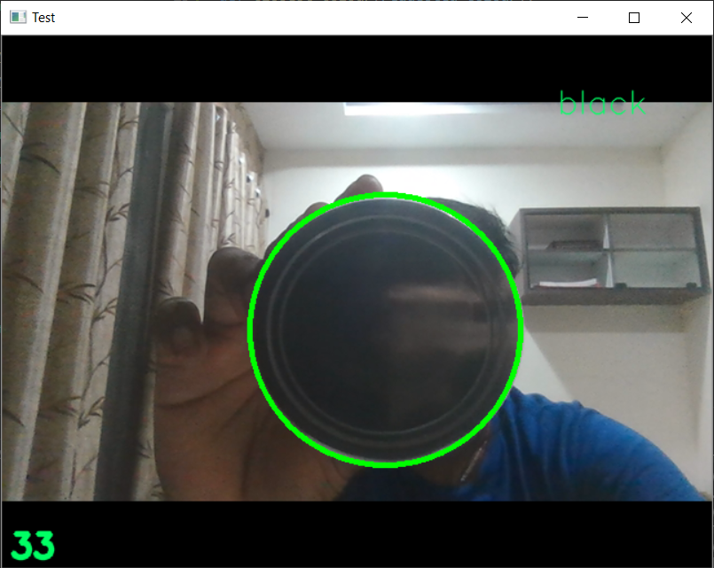

# PADA-dropzone-detection
### To run this install the dependencies using
```
pip install -r requirements.txt
```

### To run this use the following command lines
```
python main.py
```

### Preview
<p align="center">
  
 </p>
